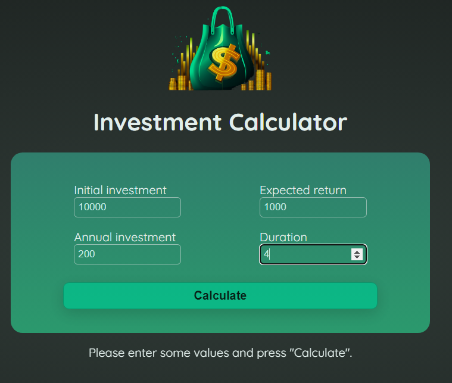
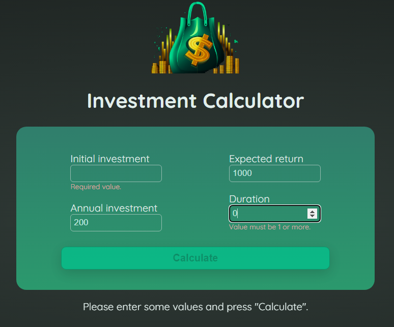
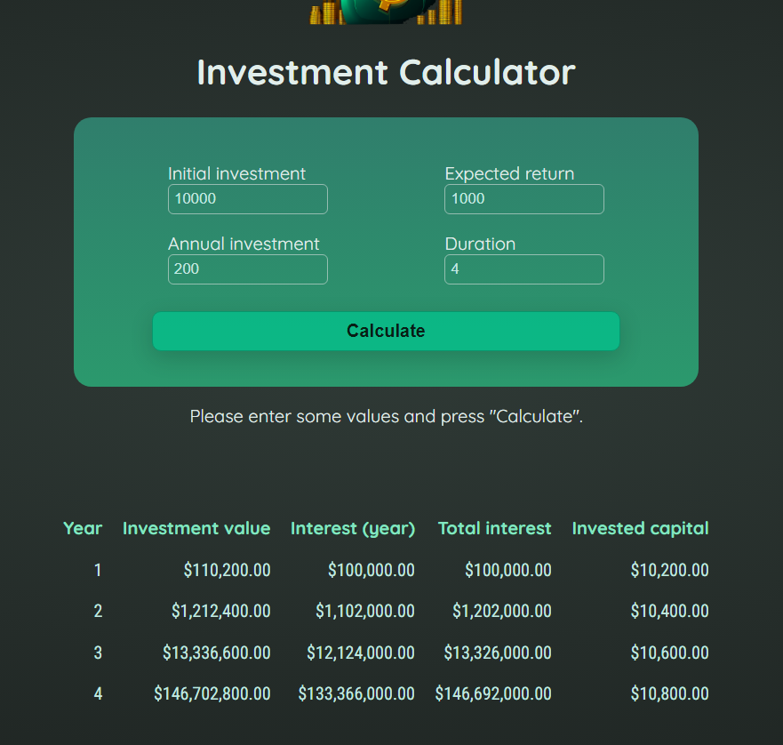

# Investment calculator

This project was generated with [Angular CLI](https://github.com/angular/angular-cli) version 18.0.0-next.2.

Exercise suggestion from Udemy course [Angular - The Complete Guide (2024 Edition)](https://www.udemy.com/course/the-complete-guide-to-angular-2) about the Angular basics.

The function that generates the investment values was implemented by the course instructor (Maximilian Schwarzmüller) because it is outside of my area of expertise, but I created the rest of the code and integrated this function into my code.

## Development server

You can download the code and install with `npm install`. Please, note that for running `npm` you need to install NodeJS.

So, run `ng serve` for a dev server. Navigate to `http://localhost:4200/` and see the application running.

## Project overview

Here are some images to illustrate the project. The basic idea is insert some values of an investment and receive a table that shows the investment results.

The fields have some validation too and the "Calculate" button is disabled when one or more fields don't pass in the valdation.

Here is the table with results:

